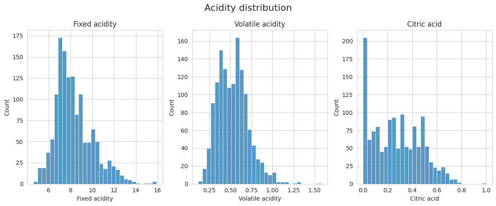
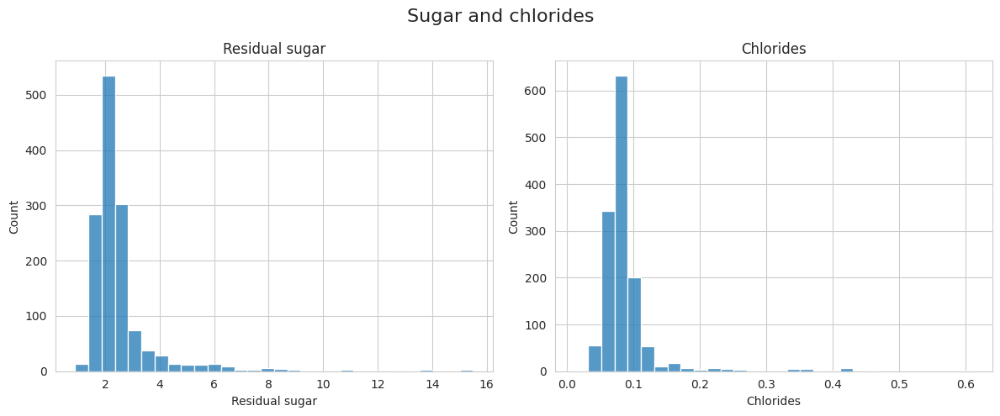
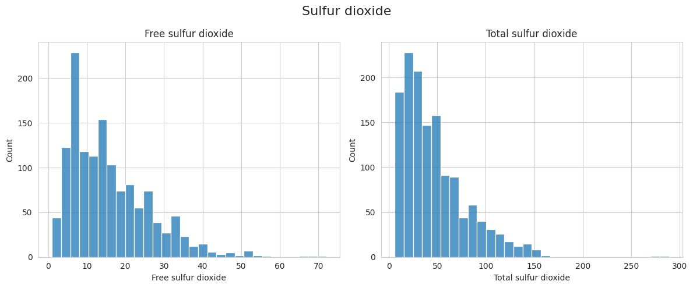
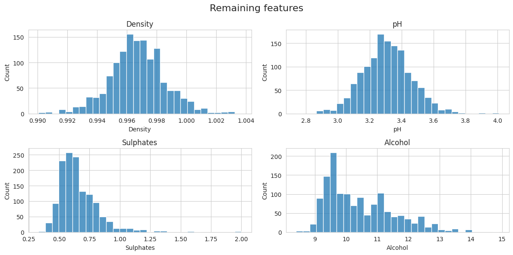
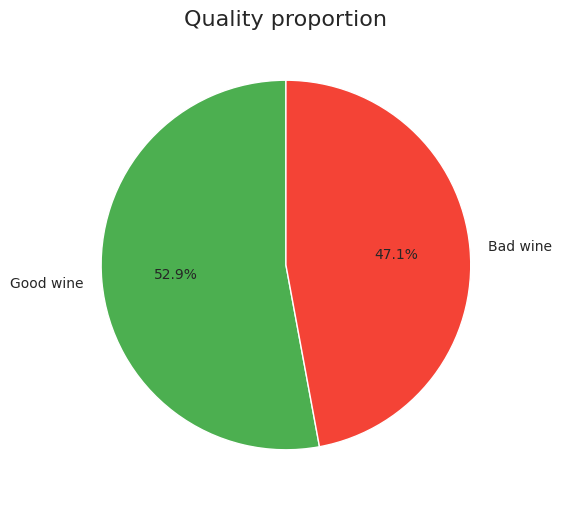
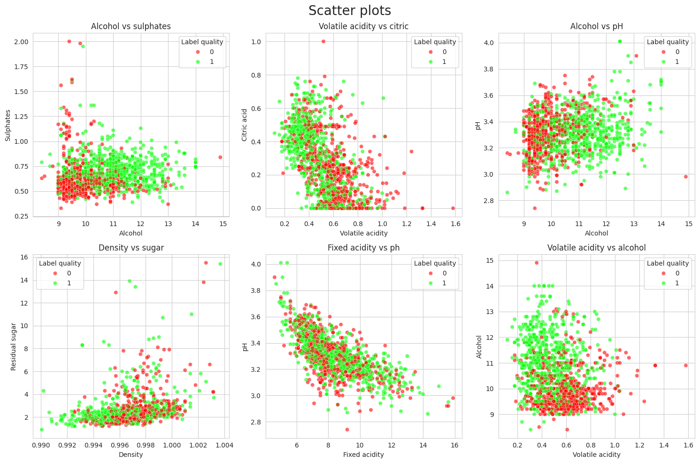
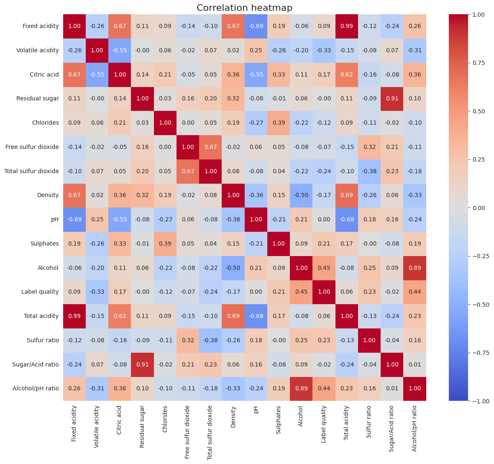
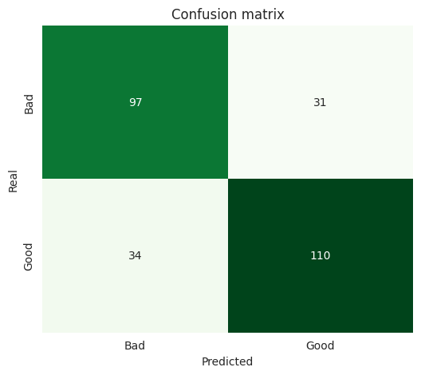
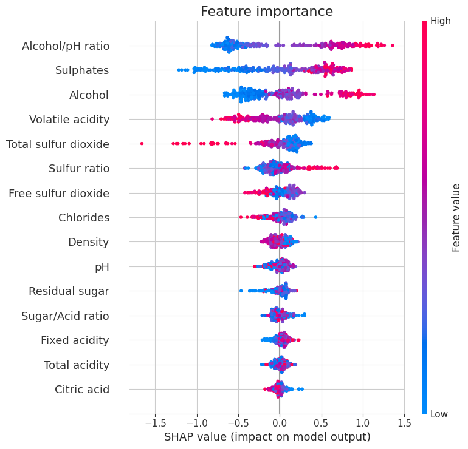
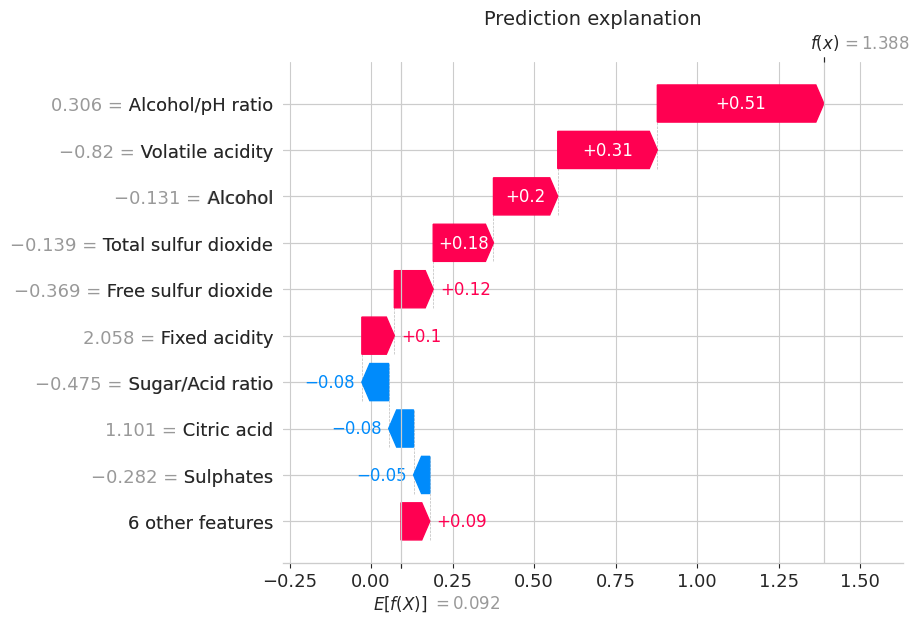

# Red wines quality classification with XGBoost and SHAP

Predicting whether a red wine is **good** or **bad** based on physicochemical tests.  
This project demonstrates an end-to-end ML workflow - **EDA -> feature engineering -> model training and tuning -> evaluation -> SHAP explainability**

---

## Dashboard - key figures and plots

  

 

  

 

  

 

  

 

  

 

  

 

  

 

  

 

  

 

  

---

## Problem statement

The original dataset contains a numeric **quality** score.  
In this project it is converted into a binary target:

- **Bad wine (0)** - quality <= 5  
- **Good wine (1)** - quality > 5

The goal is to train a model that can predict quality using chemical features

---

## Dataset

- Source - Kaggle mirror - `uciml/red-wine-quality-cortez-et-al-2009`
- File - `winequality-red.csv`

Basic cleaning steps:
- removed duplicates
- standardized column names
- created the binary target label (`Label quality`)

---

## Exploratory data analysis

Key EDA steps:
- distribution analysis for each feature
- class balance visualization - good vs bad
- scatter plots for multivariate relationships
- correlation heatmap for feature interactions

---

## Feature engineering

To capture more domain-relevant interactions, the following features were added:

- **Total acidity** = fixed acidity + volatile acidity  
- **Sulfur ratio** = free sulfur dioxide / (total sulfur dioxide + epsilon)  
- **Sugar/Acid ratio** = residual sugar / (fixed acidity + epsilon)  
- **Alcohol/pH ratio** = alcohol / (pH + epsilon)  

These features help the model learn nonlinear chemical relationships that may influence quality perception. Epsilon (1e-6) was added to prevent dividing by 0.

---

## Model

### Algorithm
- **XGBoost (XGBClassifier)**

### Training setup
- stratified train/test split 80/20
- scaling via `StandardScaler` (for consistency in preprocessing)
- hyperparameter tuning using **RandomizedSearchCV**
  - scoring: `f1_macro`
  - CV: 3-fold
  - `n_iter = 30`

---

## Results

Example test results from one run:

- **Accuracy:** ~0.761  
- **Macro F1-score:** ~0.760  

Confusion matrix (bad/good):

|              | Pred: bad | Pred: good |
|--------------|-----------|------------|
| **Real: bad**  | 97        | 31         |
| **Real: good** | 34        | 110        |

Interpretation:
- The model performs reasonably well on both classes
- Errors mostly happen near the borderline between “bad” and “good” - which is expected with this dataset

---

## SHAP explainability

I use **SHAP** in this project to interpret the trained XGBoost model:

### Global explanation
- SHAP summary plot shows which features matter most overall

### Local explanation
- SHAP waterfall plot explains individual predictions - why a specific wine was predicted as good or bad

Typical findings:
- **Alcohol** and **Alcohol/pH ratio** tend to push predictions toward "good"
- **High volatile acidity** often pushes predictions toward “bad”
- **Sulphates** also have a strong influence as antioxidant effect and taste balance
  
---
## Author

- **Author -** [Przemysław Dyjak](https://www.linkedin.com/in/przemys%C5%82aw-dyjak-666a11356/?trk=public-profile-join-page)

